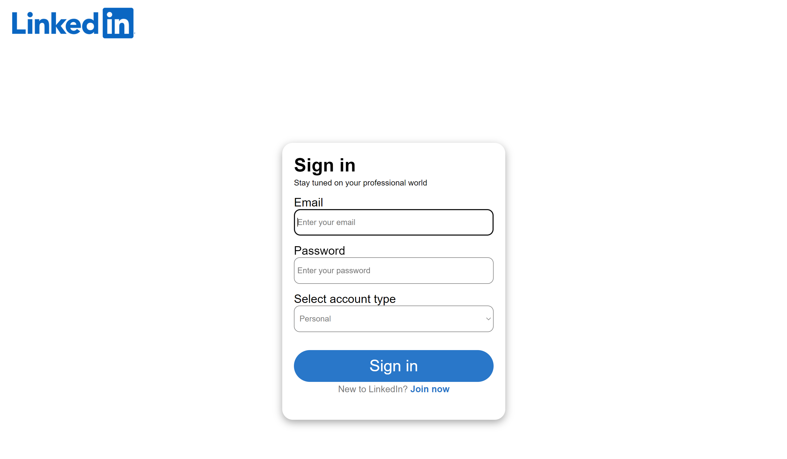
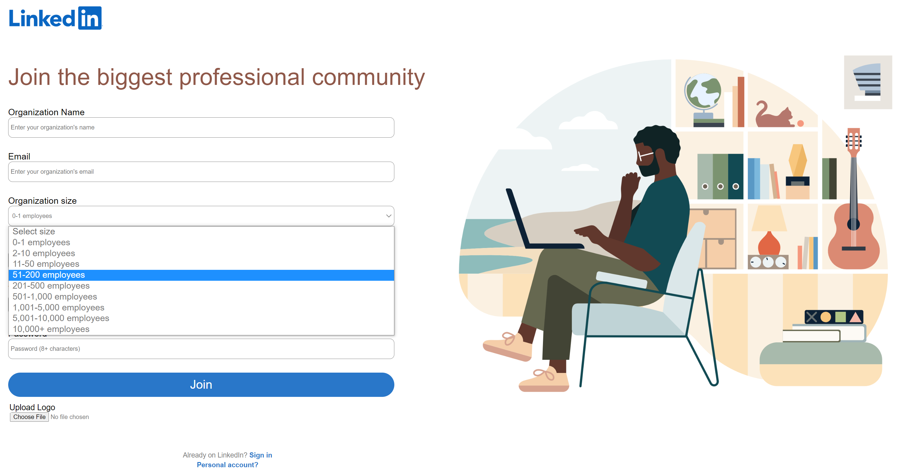
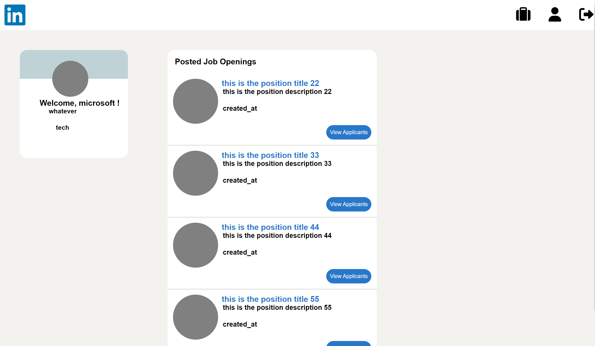

# Linkedin Clone

Linkedin clone using React, Node.js, and MongoDB.
* Users and Companies shall be able to Signup / Signin
* Users shall be able to edit profile
* Companies shall be to post job openings
* Users shall be able to search for job offerings
* Users shall be able to “easy apply” for jobs - their profiles are automatically then shared with the companies
* Companies shall be able to review applicants
* Users shall be able to follow companies and receive notifications when new job offering is posted.

# Figma Pages
[Figma URL](https://www.figma.com/file/h19pCYrcciS5X5Qzz2ftaX/Untitled?node-id=0%3A1)

# Screenshots of the present pages

